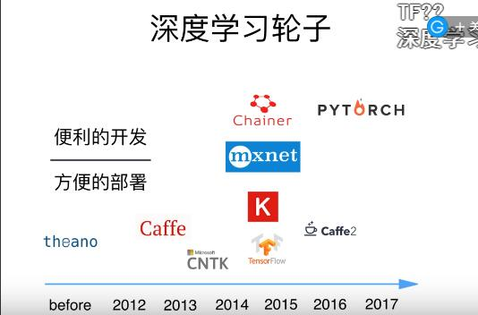
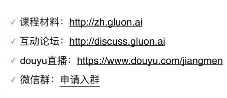

[TOC]

# 第一课：从上手到多类分类

## 问题解答

### Mxnet是什么？

+ mxnet是亚马逊选择的深度学习库
+ 底层由c++实现，提供多种语言的借口
+ mxnet支持分布式 theano 和torch只支持单机版
+ mxnet可以在多设备使用 加快速度
+ 速度和占用内存都比caffe快和小

### Gluon 框架（动态图框架）

+ Mxnet的高级接口
+ 可以支持灵活的动态图和高效的静态图

## 深度学习初了解


### 增强学习

### 物体识别

### 语音识别

### 机器翻译

### 推荐系统

### 点击预测






## 安装 


+ 下载Miniconda
+ bash  Miniconda安装文件
+ git clone https://github.com/mli/gluon-tutorials-zh
+ cd gluon-tutirial-zh
+ 使用国内镜像

```
# 配置清华conda镜像
conda config --add channels https://mirrors.tuna.tsinghua.edu.cn/anaconda/pkgs/free/
conda config --add channels https://mirrors.tuna.tsinghua.edu.cn/anaconda/pkgs/main/
# 配置清华PyPI镜像（如无法运行，将pip版本升级到>=10.0.0）
pip config set global.index-url https://pypi.tuna.tsinghua.edu.cn/simple
```

+ 接下来使用conda创建虚拟环境并安装本书需要的软件。这里`environment.yml`是放置在代码压缩包中的文件。使用文本编辑器打开该文件，即可查看运行压缩包中本书的代码所依赖的软件（如MXNet和`d2lzh`包）及版本号。

```
conda env create -f environment.yml
```

+ 第四步是激活之前创建的环境

```
conda activate gluon  
```

+ 第五步是打开Jupyter记事本。

```
jupyter notebook

```

+ 然后安装notedown 运行jupyter 并加载notedown插件

```
pip install https://github.com/mli/notedown/tarball/master
jupyter notebook --NotebookApp.contents_manager_class='notedown.NotedownContentsManager'
```

+ **jupyter**

  Ctrl+enter执行代码


## 数据操作

### NDArray

+ 是一个类，也是存储和变换数据的主要工具
+ NDArray提供GPU计算和自动求梯度等更多功能

### 梯度

## 线性回归

+ 给你一个目标值 找到一个线拟合给的数据和目标值
+ 


