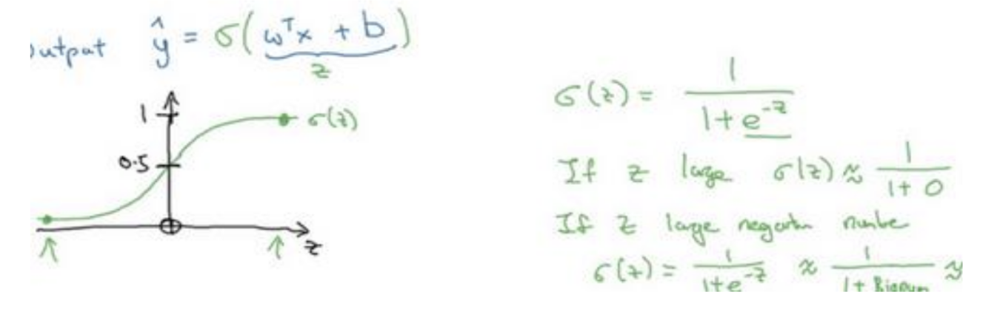
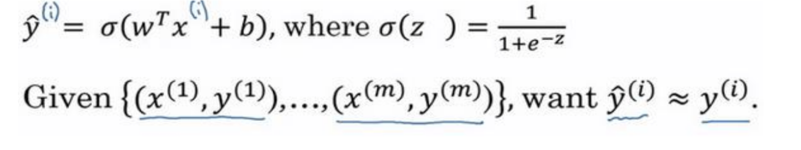
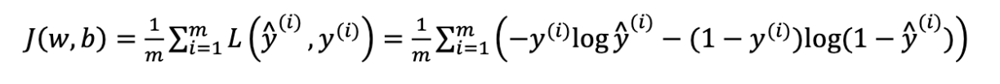
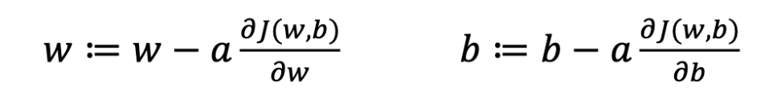
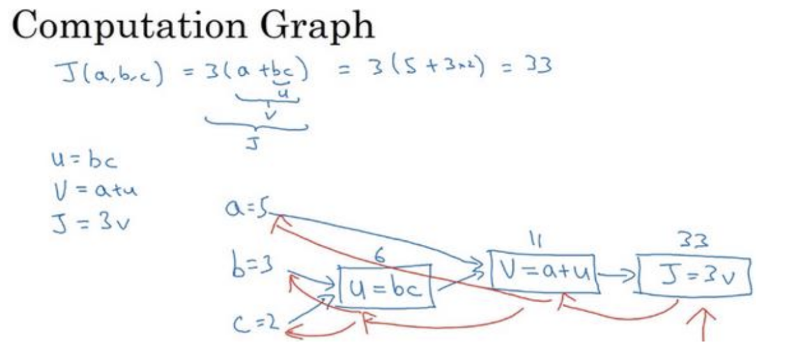
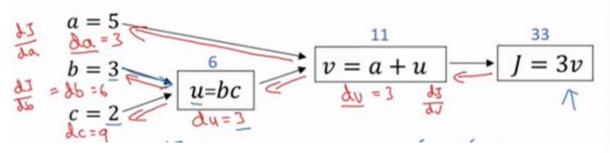
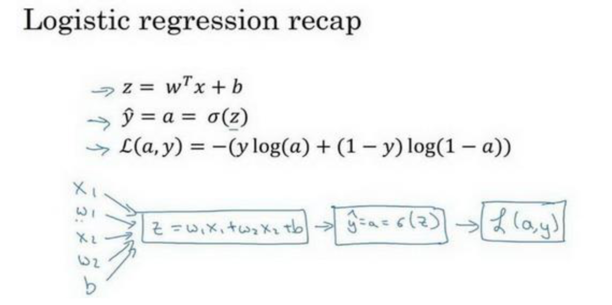

[TOC]

## 第一周 深度学习概论

### 什么是神经网络

+ 例如，房屋价格预测

  把房屋的面积作为神经网络的输入(称之为X) ，通过一个节点，最终输出了价格(称之为y)。

  如果还有一些其他的特征可以作为房屋预测价格神经网络的输入

  

  其中有 房屋大小、卧室数量、邮政编码、富裕程度 作为输入(X)

  在上图中每一个画的小圆圈都可以使ReLU的一部分，也就是指修正线性单元，或者它稍微非线性的函数。

  其中基于房屋面积和卧室数量，可以估算家庭人口；基于邮编，可以估测不行化程度或者学校质量。

  y是用神经网络尝试预测的价格，把这些单个的神经元叠加在一起，就有了一个稍微大的神经网络。

  定义好神经网络之后，我们需要做的就是输入x，进而就能得到输出的y。

  所以在实际工作中我们需要做的就是：给出这些输入的特征之后，神经网络的工作就是预测对应的价格。同时也注意到这些被叫做隐藏神经元圆圈，在一个神经网络中，它们每个都从输入的四个特征获得自身输入，比如说，第一个结点代表家庭人口，而家庭人口仅仅取决于$x_1 和 x_2$ 特征，换句话说，在神经网络中，你决定在这个结点中想要的到什么，然后用所有的四个输入来计算想要得到的。因此，我们说输入层和中间层被紧密的连接起来了。

  神经网络非常擅长计算从x到y的精准映射函数。

+ ReLU激活函数

  **Rectified Linear Unit** 从趋于零开始，然后变成一条直线。

  可以理解为$max(0,x)$ 

### 用神经网络进行监督学习

+ 神经网络的应用

  在线广告、计算机视觉、语音识别、自动驾驶。

  对于图像应用我们在神将网络上使用CNN(Convolutional Neural Network)，而对于序列数据，例如音频，经常使用RNN(Recurrent Neural Network)，etc。 

  **结构化数据和非结构化数据**

  + 结构化数据

    数据的基本数据库 例如房屋预测 有专门的几列数据

  + 非结构化数据

    音频，图片

  + 正是由于深度学习和神经网络，计算机才能更好的解释非结构化数据。

+ 在监督学习中输入

   神经网络很大程度上改变了深度学习

### 为什么深度学习会兴起？

推动深度学习变得如此热门的主要因素。包括数据规模、计算量和算法的创新。

+ 

  - 对于传统的学习算法

    最终的性能取决于手工设计组件的技能，以及算法处理的细节

  - 神经网络领先于传统学习算法

  - 如果想要获得较高性能的体现需要做以下两点：

    - 训练一个规模足够大的神经网络
    - 需要大量的数据

+ 神将网络方面 的一个重大突破就是$sigmoid函数转换到一个ReLU函数$

  + 
  + **sigmoid**函数的梯度会接近零，所以学习的速度会变得非常缓慢，因为当梯度下降以及梯度接近零的时候，参数会更新的很慢，所以学习的速率也会变得很慢
  + **ReLU** 函数，它的梯度对于所有输入的复值都是零，因此梯度更加不会逐渐减少到零。
  + 算法的创新是对计算带来的优化，通过改变算法，使得代码运行的更快。

+ 训练一个神将网络的步骤就是迭代

  

## 第二周 深度学习基础

### 二分分类

+ 处理训练集

+ 前向传播 和 反向传播

+ 二分类

  判断一张图片是否为猫 是输出1 不是输出0

  计算机为了保存一张图片  需要保存三个矩阵，分别对应着图片中的、黄、蓝三色通道。把所有的像素值放到一个特征向向量中$x$ 。

  在二分类问题中，我们的目标是习得一个分类器，它以图片的特征向量作为输入，然后预测输出结果$y$ 为1 还是 0 ，也就是预测图片中是否有猫：

### 逻辑回归

逻辑回归属于二分类问题

+ 二元分类问题

  给定一个输入特征向量$x$ , $x$ 可能对应一张图片，若相对这张图片进行预测，需要一个算法，称之为$\hat{y}$ 。$\hat{y}$  表示 $y$  等于 1 的一种可能性或者是机会，前提条件是给定了输入特征  $x$  。

  其中    $x  $是一个 $ n_x $ 维的  向量，$w $  表示逻辑回归的参数  $b $ 是一个实数，表示偏差。

  $\hat{y} = w^Tx + b$     <—   关于  $x$ 的线性函数

  $\hat{y}$  应该在 0 ~ 1 之间 ，因此使用 sigmoid 函数

  

  因此使用逻辑回归的时候，需要做的工作就是让机器学习参数$w$ 以及$b$ 这样才使得   $\hat{y}$  成为对  y = 1 这一情况的概率的一个很好的估计。

  有些情况下需要定义一个额外的特征称为$x_0$, 并且 使  $x_0 = 1$   那么X 就是一个$n_x  + 1$ 维的变量， 然后定义$\hat{y} = a(\theta^T x)$   的sigmoid函数。在这个备选的符号惯例里，参数向量$\theta_0,\theta_1,\theta_2,…….,\theta_{n_x}$ ,这样$\theta_0$ 就充当了 b， 剩下的充当了w。

  接下来就是训练参数w和参数b，因此需要定义一个代价函数。

### 逻辑回归的代价函数

+ 为什么要用代价函数

  为了训练逻辑回归模型的参数$w$ 和参数 $b$ 

  通过训练代价函数来得到参数$w$ 和参数$b$ 

  逻辑回归的输出参数：

  

+ 损失函数

  又叫误差函数，用来衡量算法的运行情况，$Loss function:L(\hat{y},y)$

  一般用预测值和实际值的平方差或者它们平方差的一半，但是通常在逻辑回归中不这么做，因为有可能优化目标不是凸函数，只能找到多个局部最优值，梯度下降法很可能找不到全局最优值。

  因此在逻辑回归中使用的损失函数

  $L(\hat{y}, y) = -ylog(\hat{y}) - (1 - y)log(1 - \hat{y})$

  **为什么使用该损失函数呢**？

  如果$y = 1      \hat{y}$ 就要无限的大

  如果$y = 0 \hat{y}$ 就要无限的小

  损失函数 是在单个训练样本中定义的，它衡量的是算法在单个训练样本中表现如何，为了衡量算法在全部训练样本上的表现如何，定义了一个算法的代价函数，

     

  损失函数只适用于像这样的单个训练样本，而代价函数是参数的总代价，所以在训练逻辑回归模型时候，我们需要找到合适的$w$ 和$b$ ,来让代价函数$J$ 的总代价降到最低。

### 梯度下降法

梯度下降法通过最小化代价函数$J(w, b)$ 来训练的参数$w$ 和$b$ 

随机初始化$w$ 和$b$ 

朝最陡的下坡方向走一步，不停 地迭代

直到走到全局最优解或者接近全局最优解的地方

+ 仅有一个参数的梯度下降

  代价函数$J(w) $ 只有一个参数$w$ ,即用一维曲线代替多维曲线，这样可以画出更好的图像

  ```
  Repeat{
    w := w - a*d(J(w))/dw
  }
  
  := 表示更新参数
  a 表示学习率 ，用来控制步长
  d(J(w))/dw  函数J(w) 对 w 求导
  ```

  因此当$dJ(w)/dw > 0$ 时，接下来 会像左走一步

  同理 ， $dJ(w)/dw < 0$时，会向右走一步

  即朝着最小点的方向走。

+ 有两个参数时候

     

### 导数

略

### 计算图

+ 前向传播

  计算出一个新的网络的输出

+ 反向传播

  计算出对应的梯度或导数

+    

  计算图组织计算的形式使用蓝色箭头从左到右的计算，红色箭头反向计算导数。

  链式法则 ： 如果𝑎影响到𝑣，𝑣影响到𝐽

  $dJ/dv$就是𝐽对变量𝑣的导数，它可以帮助你计算$dJ/da$，所以这是另

  一步反向传播计算。 

  当进行反向传播时，通常会有一个最终的输出值。此情况下最终的输出值J，就是流程图的最后一个符号

  

  计算所有这些导数时，最有效率的办法就是从右到左计算

  所以这是一个计算流程图

  通过正向计算来计算成本函数，通过反向计算计算导数

### 逻辑回归的梯度下降法

通过偏导数来实现逻辑回归的梯度下降法

假设样本只有两个特征$x_1$ 和$x_2$ ，为了计算$z$ ，我们需要输入参数$w_1,w_2$和$b$,除此之外还有特征值$x_1$和$x_2$。因此$z$的计算公式为: $z = w_1x_1 + w_2x_2+b$ 

+ 逻辑回归的公式

  $\hat{y} = a = 𝜎(𝑧)$  

  $𝑧=𝑤^T 𝑥+𝑏$ 

  $ 𝜎(𝑧)=\frac {1} { 1 + e^{-z}}$

  损失函数：$L(\hat{y}^{(i)}, y^{(i)}) = -y^{(i)}log\hat{y}^{(i)} - (1 - y^{(i)})log(1-\hat{y}^{(i)})$

  代价函数：$J(w,b) = \frac{1}{m}\sum_i^mL(\hat{y}^{(i)},y^{(i)})$

  假设现在只考虑单个样本的情况，单个样本的代价函数定义如下：

  $L(a, y) = -(ylog(a) + (1 - y)loag(1 - a))$

  其中a是逻辑回归的输出，y是样本的标签值。

  以下是这个计算的计算图：

  

  梯度下降法：

  $w := w - a \frac{\partial{J(w,b)}}{\partial{w}},  \quad b:= b - a\frac{\partial{J(w,b)}}{\partial{b}}$

  为了使得逻辑回归中最小化代价函数$L(a,y) $ ,仅仅需要修改参数$w$ 和$b$的值。

  接下来计算代价函数$ L(a, y) $ 的 导数，

  $\frac{dL(a,y)}{da} = -y/a + (1- y)/(1-a)$

  就是得：

  $dz = \frac{dL(a,y)}{dz}  = \frac{dL}{dz} = (\frac{dL}{da}) \frac{}{} \frac{da}{dz} = (-\frac{y}{a} + \frac{(1-y)}{(1-a)})\frac{}{}a(1-a) = a- y$

  最后一步反向推导，也就是计算$w$ 和$b$ 变化对代价函数$L$ 的影响。

  $ dw_1 = \frac{1}{m} \sum_i^mx_1^{(i)}(a^{(i)} - y{(i)})$

  $dw_2 = \frac{1}{m}\sum_i^mx_2^{(i)}(a^{(i)} - y^{(i)})$

  $db = \frac{1}{m}\sum_i^m(a^{(i)} - y^{(i)})$

  然后进行迭代更新：

  $w_1 = w_1 - adw_1$

  $w_2 = w_2 - adw_2$

  $b = b - adb$

### m个样本的梯度下降

$J(w, b) = \frac{1}{m} \sum_i=1^mL(a^{(i)}, y^{(i)})$

$a^{(i)} $是训练样本的预测值，即: $\sigma(z^{(i)}) = \sigma(w^Tx^{(i)} + b)$

上一节讲解的是单个训练样本，每一个超参数的值都是单独计算的

代码流程：

```
J = 0; dw1 = 0; dw2 = 0; db = 0;
for i = 1 to m:
	z(i) = wx(i) + b;
	a(i) = sigmoid(z(i));
	J += -[y(i)log(a(i)) + (1 - y(i))log(1-a(i))];
	dz(i) = a(i) - y(i);
	dw1 += x1(i)dz(i);
	dw2 += x2(i)dz(i);
	db += dz(i);
	
J /= m;
dw1 /= m;
dw2 /= m;
db /= m;
w = w-alpha*dw;
b = b - alpha*db;
```

该计算的缺点 ，用了for循环，效率很低

从而引入了向量化

### 向量化

向量化是非常基础的去处代码中for循环的技术，是一个关键的技巧。

例如  ： [向量化和非向量化的区别]()


