[TOC]

## 第三周 浅层神经网络

### 神经网络概览

+ 逻辑回归模型

​        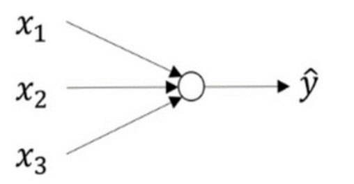

​       公式：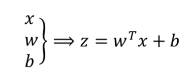

​		接下来用z可以 计算出  $a$ .将符号换为表示输出    $\hat{y}  ⟹ a = \alpha(z)$ 然后可以计算出  	**loss function $L(a, y)$**   

+ 神经网络模型

  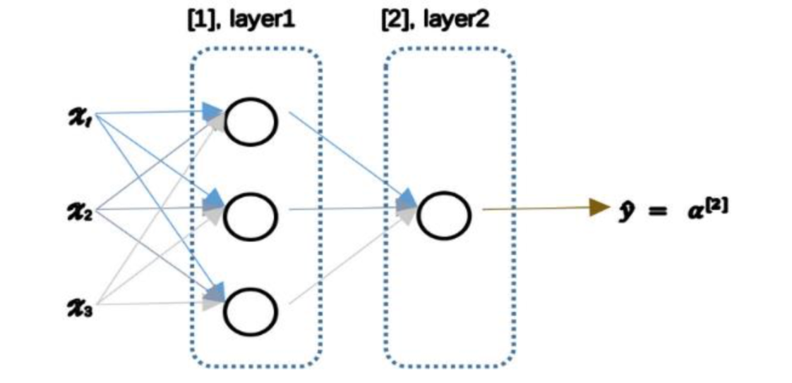

  可以把许多$sigmoid$ 单元堆叠起来形成一个神经网络。

  这个神经网络对应的3个结点，

  + 首先计算第一层网络中的各个结点相关的数   $z^{[1]}$  ,接着计算   $\alpha^{[1]}$  , 再计算下一层网络同理： 我们会使用符号   $^{[m]}$    表示  第m层网络中结点相关的数，这些节点的集合被称为第$m$   层网络，
  + 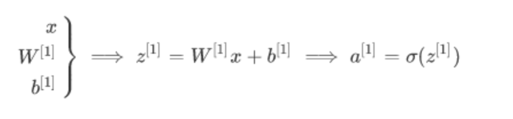
  + 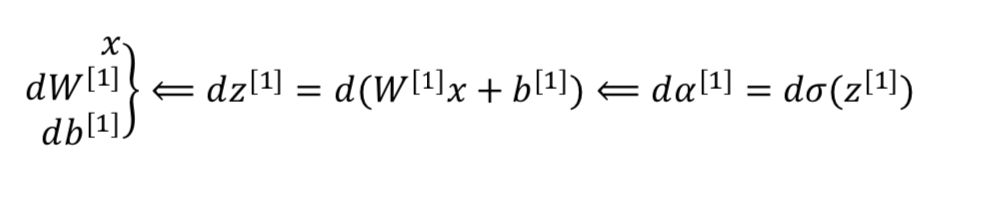
  + 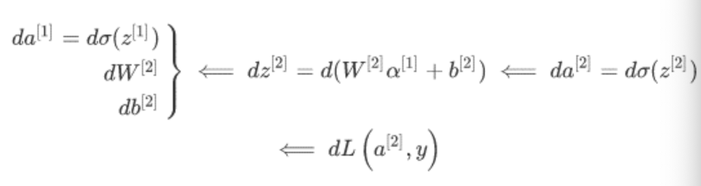
  + 基于逻辑回归重复使用了两次该模型得到上述的神经网络

### 神经网络的表示

+ 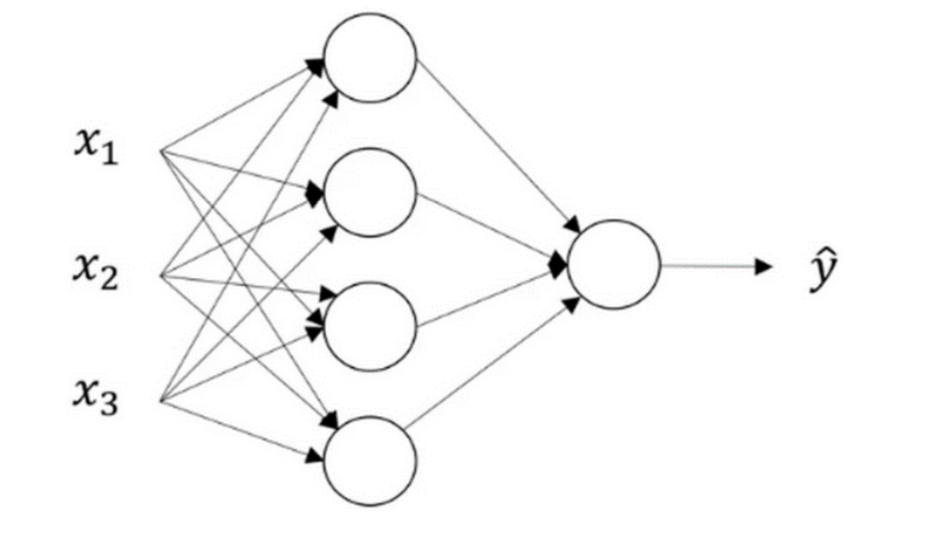

  + 输入特征  $x_1  、x_2、x_3$  竖直地堆叠起来，这叫做神经网络的 **输入层** 

    包括了神经网络的输入

  + 后面一层叫作 **隐藏层**

    在一个神经网络中，使用监督学习训练它的时候，训练集包含了输入  $x$  也包含了目标输出  $y$  ，所以隐藏层的中间节点的准确值我们是不知道的。

  + 最后一层叫作   **输出层**负责产生预测值

  + $a^{[0]}$   表示输入特征   $a$  表示激活的意思，意味着网络中不同层的值会传递到他们后面的层中，输入层将 $x$ 的值传递给隐藏层，将输入层的激活值称为 $a^{[0]}$   ；

    隐藏层也会同样产生一些激活值，记作$a^{[1]}$ , 因此这里的第一个单元或结点称为   $a_1^{[1]}$   

    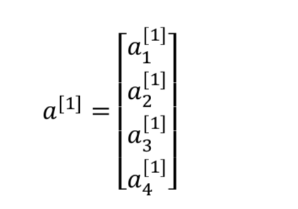

    最后输出层将产生某个数值 $a$ ,它只有一个单独的实数，所以  $\hat{y}$  值将取为  $a^{[2]}$  .

  + 在计算网络的层次的时候，输入层不算入。或者说输入层是第0层

    

### 计算一个神经网络的输出

+ 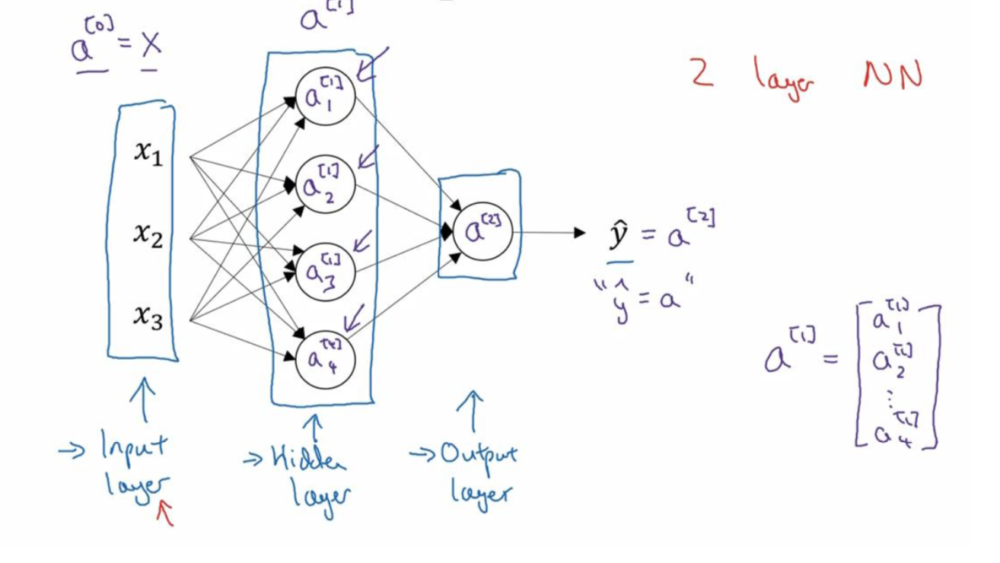

  + $x$  表示输入特征， $a$  表示每个神经元的输出 ， $W$ 表示特征的权重，上标表示神经网络的层数，下标表示该层的第几个神经元。

+ 神经网络的计算

  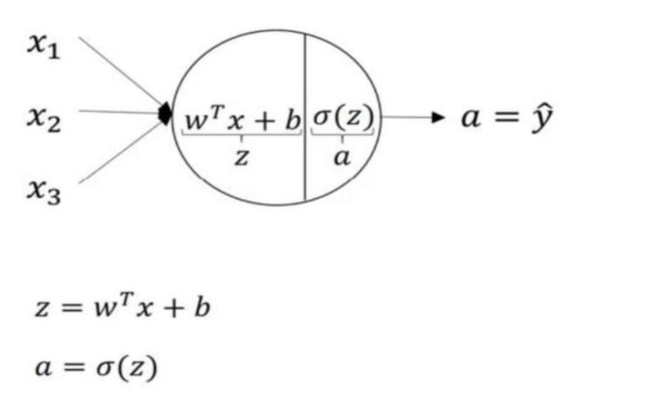

  + 计算  $z_1^{[1]},  z_1^{[1]} = w_1^{[1]T} x + b_1^{[1]}$

  + 通过激活函数计算   $a_1^{[1]},   a_1^{[1]} = \alpha(z_1^{[1]})$

  + 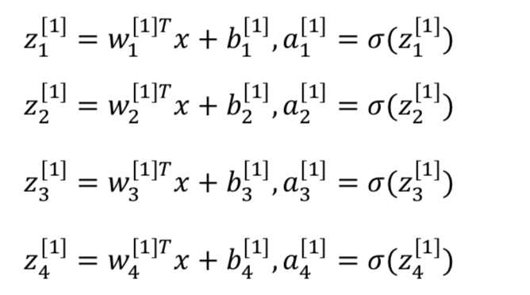

  + **向量化计算** 

    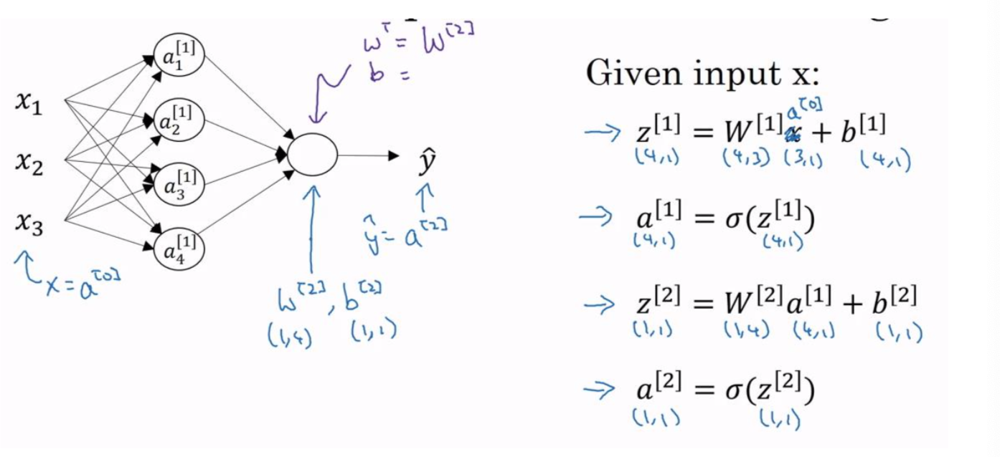

    不需要使用for循环，一次就可以计算出不止一个样本的神经网络输出。

### 多样本向量化

逻辑回归是将各个训练样本组合成矩阵，对矩阵的各列进行计算。

神经网络是通过对逻辑回归中的等式简单的变形，让神经网络计算出输出值。

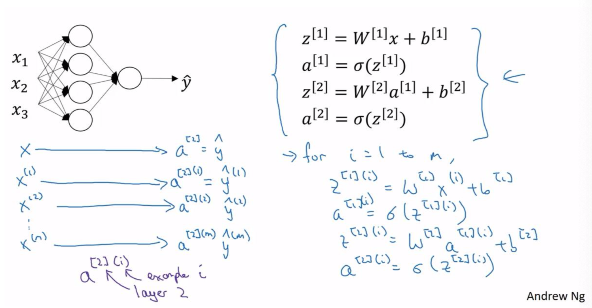

+ m个样本

  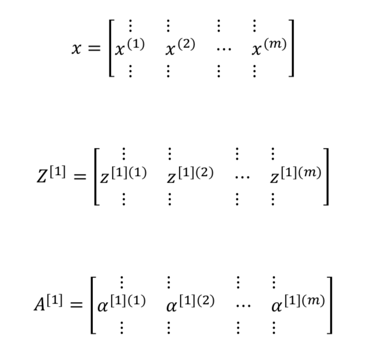

  

  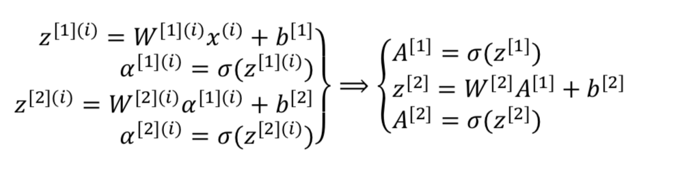

###  向量化实现的解释

+ 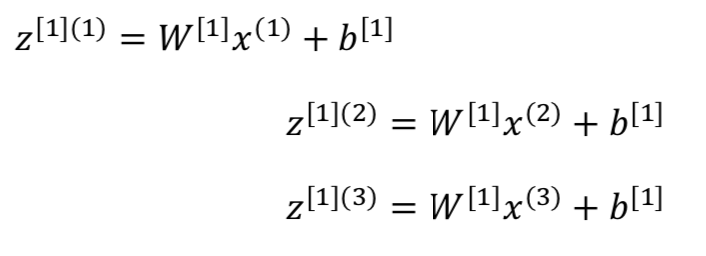

  + 具体计算过程

    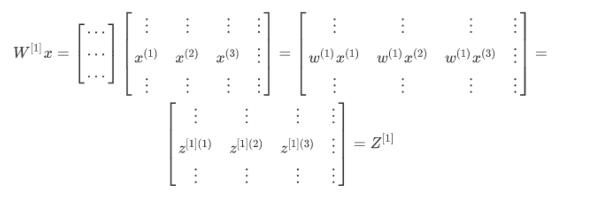

    若想加入更多的样本，只需要在$X$ 中加入更多的列

### 激活函数

+ sigmoid激活函数

  $a  = \alpha(z) = \frac{1}{1 + e^{-z}}$    

+ $a = tanh(z) = \frac{e^z + e^{-z}}{e^z + e^{-z}}$  值域是位于  +1 和  -1 之间

+ ReLu 修正线性单元的函数

  $ a =  max(0 , z)$   

+ 选择激活函数的法则：

  + 如果输出是 0， 1(二分类) 输出层用$sigmoid$ 函数，其他的所有单元都选择Relu函数

  + 当不知道选择哪个的时候 ，用$relu$ 

  + 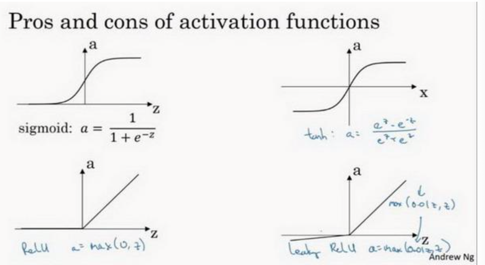

  + **ReLu还有另一个版本Leaky Relu**

    两者的优点是：

    + 在$z$的区间变动很大的情况下，激活函数的导数或者激活函数的斜率都会远大于0 ， 在程序实现就是一个$if-else$ 语句，

    + 在实践中，$Relu$ 激活函数神经网络通常会比使用 $sigmoid$ 或者 $tanh$ 激活函数学习的更快

    + $sigmoid$ 或者 $tanh$ 激活函数的导数在正负饱和区的梯度都会接近于0， 这会造成梯度弥散，而$Relu$ 和$Leaky\  Relu$ 函数大于0部分都会为常数，不会昌盛梯度弥散现象

    + **Leaky Relu**   

      $a = max(0.01z, z)$  

    + 如果不知道使用哪一个激活函数效果更好，可以把他们都试试，然后在验证集或者发展集上进行评价。

###  为什么要使用非线性激活函数？

"掰弯"线性函数

### 激活函数的导数

+ Sigmoid activation function

  $g(z) = \frac{1}{1 + e^{-z}}$  

  求导 $\frac{d}{dz}g(z) = \frac{1}{1 + e^{-z}}(1 - \frac{1}{1 + e^{-z}}) = g(z)(1 -g(z))$

+ Tanh activation function

  $g(z) = tanh(z) = \frac{e^z + e^{-z}}{e^z + e^{-z}}$

  $\frac{d}{dz}g(z) = 1 - (tanh(z))^2$

+ **ReLu**

  $g(z) = max(0, z) $

  $g(z) = max(0.01z, z)$

### 神经网络的梯度下降

+ **Cost function**

  $J(W^{[1]}, b^{[1]}, W^{[2]},b^{[2]}) = \frac{1}{m} \sum_{i=1}^m L (\hat{y}, y)$

+ **back propagation**

  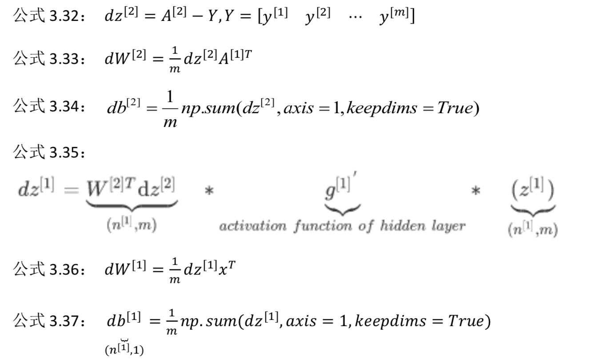

  这些都是针对所有样本进行过向量化的， Y是$1 \times m$ 的矩阵

  $axis = 1$ 表示水平相加求和   $keepdims $  是防止python输出那些古怪的秩数

### 直观理解反向传播

在神经网络中，与逻辑回归十分类似， 但中间会有很多层的计算。

+ **前向传播**

  计算$z^{[1]} , a^{[1]}  $   再计算 $z^{[2]} , a^{[2]}$  最后得到 **loss Function**

+ **反向传播**

  向后推算出$da^{[2]}  $ ， 然后推算出 $dz^{[2]}$  ,接着推算出 $da^{[1]}$  ，然后推算出 $dz^{[1]}$ 。 

  略，(公式太多了)

+ 初始化权重的时候，最好不要都是0

### 随机初始化

对于逻辑回归，把权重全部初始化为0 是可以的， 但是对于一个神经网络，如果把权重或者参数都初始化为0， 那么梯度下降将不会起作用。

+ 为什么梯度下降不会起作用？

  有两个输入特征 $n^{[0]} = 2$ 

  2个隐藏层单元$  n^{[1]} = 2$ 

  $W^{[1]} $ 是 $2*2$ 矩阵， 假设全部初始化为0 ， $a_1^{[1]} 和  a_2^{[2]} $相等， 

  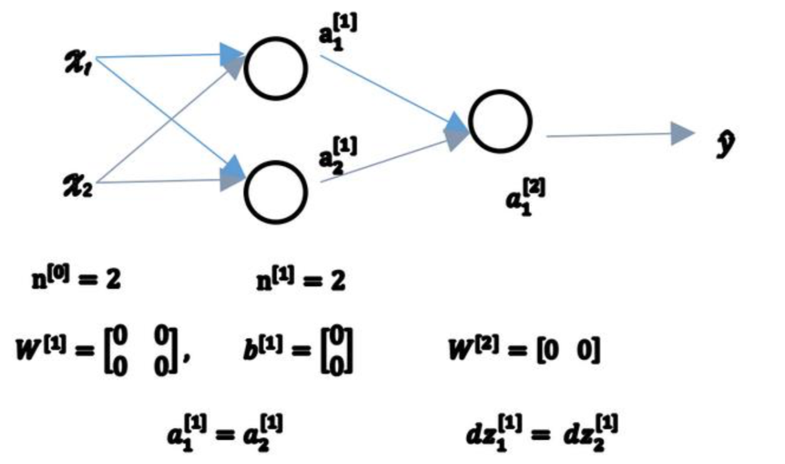

  如果把权重都初始化为0 ， 那么由于隐含单元开始计算同一个函数，所有的隐含单元就会对输出单元有同样的影响。一次迭代后同样的表达式结果仍然是相同的。

  因此想要两个不同的隐含单元计算不同的函数，就是随机初始化参数

  $W^{[1]}$ 设为 $np.random.randn(2, 2)$ (生成高斯分布) ，通常再乘上一个小的数，比如0.01,这样把 它初始化为一个很小的随机数。

  至于乘上0.01是因为用的激活函数$tanh $ 或者$sigmoid$ 如果W很大 ， z 就会很大，从而 激活函数可能会停在平坦的地方，导致梯度下降很慢。

### 作业

