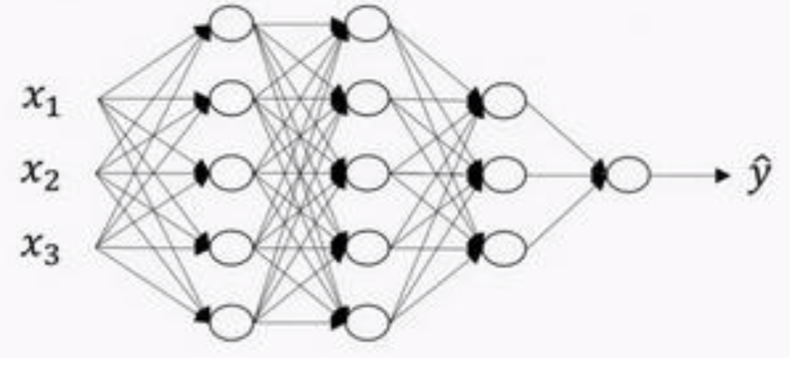
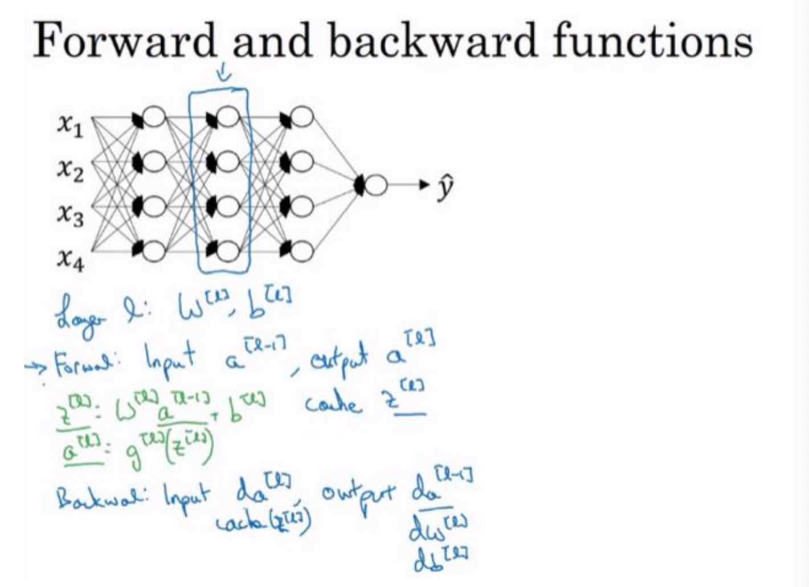
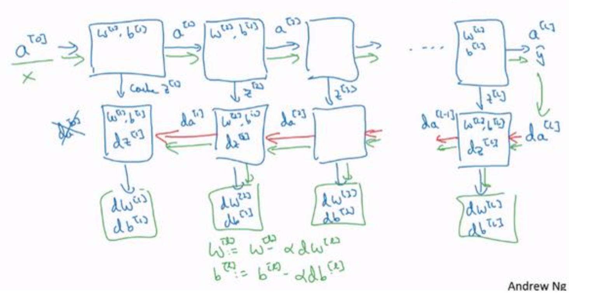

[TOC]

## 第三周 浅层神经网络

### 神经网络概览

+ 逻辑回归模型

​        

​       公式：

​		接下来用z可以 计算出  $a$ .将符号换为表示输出    $\hat{y}  ⟹ a = \alpha(z)$ 然后可以计算出  	**loss function $L(a, y)$**   

+ 神经网络模型

  

  可以把许多$sigmoid$ 单元堆叠起来形成一个神经网络。

  这个神经网络对应的3个结点，

  + 首先计算第一层网络中的各个结点相关的数   $z^{[1]}$  ,接着计算   $\alpha^{[1]}$  , 再计算下一层网络同理： 我们会使用符号   $^{[m]}$    表示  第m层网络中结点相关的数，这些节点的集合被称为第$m$   层网络，
  + 
  + 
  + 
  + 基于逻辑回归重复使用了两次该模型得到上述的神经网络

### 神经网络的表示

+ 

  + 输入特征  $x_1  、x_2、x_3$  竖直地堆叠起来，这叫做神经网络的 **输入层** 

    包括了神经网络的输入

  + 后面一层叫作 **隐藏层**

    在一个神经网络中，使用监督学习训练它的时候，训练集包含了输入  $x$  也包含了目标输出  $y$  ，所以隐藏层的中间节点的准确值我们是不知道的。

  + 最后一层叫作   **输出层**负责产生预测值

  + $a^{[0]}$   表示输入特征   $a$  表示激活的意思，意味着网络中不同层的值会传递到他们后面的层中，输入层将 $x$ 的值传递给隐藏层，将输入层的激活值称为 $a^{[0]}$   ；

    隐藏层也会同样产生一些激活值，记作$a^{[1]}$ , 因此这里的第一个单元或结点称为   $a_1^{[1]}$   

    

    最后输出层将产生某个数值 $a$ ,它只有一个单独的实数，所以  $\hat{y}$  值将取为  $a^{[2]}$  .

  + 在计算网络的层次的时候，输入层不算入。或者说输入层是第0层

    

### 计算一个神经网络的输出

+ 

  + $x$  表示输入特征， $a$  表示每个神经元的输出 ， $W$ 表示特征的权重，上标表示神经网络的层数，下标表示该层的第几个神经元。

+ 神经网络的计算

  

  + 计算  $z_1^{[1]},  z_1^{[1]} = w_1^{[1]T} x + b_1^{[1]}$

  + 通过激活函数计算   $a_1^{[1]},   a_1^{[1]} = \alpha(z_1^{[1]})$

  + 

  + **向量化计算** 

    

    不需要使用for循环，一次就可以计算出不止一个样本的神经网络输出。

### 多样本向量化

逻辑回归是将各个训练样本组合成矩阵，对矩阵的各列进行计算。

神经网络是通过对逻辑回归中的等式简单的变形，让神经网络计算出输出值。

+ m个样本

  

  

  

###  向量化实现的解释

+ 

  + 具体计算过程

    

    若想加入更多的样本，只需要在$X$ 中加入更多的列

### 激活函数

+ sigmoid激活函数

  $a  = \alpha(z) = \frac{1}{1 + e^{-z}}$    

+ $a = tanh(z) = \frac{e^z + e^{-z}}{e^z + e^{-z}}$  值域是位于  +1 和  -1 之间

+ ReLu 修正线性单元的函数

  $ a =  max(0 , z)$   

+ 选择激活函数的法则：

  + 如果输出是 0， 1(二分类) 输出层用$sigmoid$ 函数，其他的所有单元都选择Relu函数

  + 当不知道选择哪个的时候 ，用$relu$ 

  + 

  + **ReLu还有另一个版本Leaky Relu**

    两者的优点是：

    + 在$z$的区间变动很大的情况下，激活函数的导数或者激活函数的斜率都会远大于0 ， 在程序实现就是一个$if-else$ 语句，

    + 在实践中，$Relu$ 激活函数神经网络通常会比使用 $sigmoid$ 或者 $tanh$ 激活函数学习的更快

    + $sigmoid$ 或者 $tanh$ 激活函数的导数在正负饱和区的梯度都会接近于0， 这会造成梯度弥散，而$Relu$ 和$Leaky\  Relu$ 函数大于0部分都会为常数，不会昌盛梯度弥散现象

    + **Leaky Relu**   

      $a = max(0.01z, z)$  

    + 如果不知道使用哪一个激活函数效果更好，可以把他们都试试，然后在验证集或者发展集上进行评价。

###  为什么要使用非线性激活函数？

"掰弯"线性函数

### 激活函数的导数

+ Sigmoid activation function

  $g(z) = \frac{1}{1 + e^{-z}}$  

  求导 $\frac{d}{dz}g(z) = \frac{1}{1 + e^{-z}}(1 - \frac{1}{1 + e^{-z}}) = g(z)(1 -g(z))$

+ Tanh activation function

  $g(z) = tanh(z) = \frac{e^z + e^{-z}}{e^z + e^{-z}}$

  $\frac{d}{dz}g(z) = 1 - (tanh(z))^2$

+ **ReLu**

  $g(z) = max(0, z) $

  $g(z) = max(0.01z, z)$

### 神经网络的梯度下降

+ **Cost function**

  $J(W^{[1]}, b^{[1]}, W^{[2]},b^{[2]}) = \frac{1}{m} \sum_{i=1}^m L (\hat{y}, y)$

+ **back propagation**

  

  这些都是针对所有样本进行过向量化的， Y是$1 \times m$ 的矩阵

  $axis = 1$ 表示水平相加求和   $keepdims $  是防止python输出那些古怪的秩数

### 直观理解反向传播

在神经网络中，与逻辑回归十分类似， 但中间会有很多层的计算。

+ **前向传播**

  计算$z^{[1]} , a^{[1]}  $   再计算 $z^{[2]} , a^{[2]}$  最后得到 **loss Function**

+ **反向传播**

  向后推算出$da^{[2]}  $ ， 然后推算出 $dz^{[2]}$  ,接着推算出 $da^{[1]}$  ，然后推算出 $dz^{[1]}$ 。 

  略，(公式太多了)

+ 初始化权重的时候，最好不要都是0

### 随机初始化

对于逻辑回归，把权重全部初始化为0 是可以的， 但是对于一个神经网络，如果把权重或者参数都初始化为0， 那么梯度下降将不会起作用。

+ 为什么梯度下降不会起作用？

  有两个输入特征 $n^{[0]} = 2$ 

  2个隐藏层单元$  n^{[1]} = 2$ 

  $W^{[1]} $ 是 $2*2$ 矩阵， 假设全部初始化为0 ， $a_1^{[1]} 和  a_2^{[2]} $相等， 

  

  如果把权重都初始化为0 ， 那么由于隐含单元开始计算同一个函数，所有的隐含单元就会对输出单元有同样的影响。一次迭代后同样的表达式结果仍然是相同的。

  因此想要两个不同的隐含单元计算不同的函数，就是随机初始化参数

  $W^{[1]}$ 设为 $np.random.randn(2, 2)$ (生成高斯分布) ，通常再乘上一个小的数，比如0.01,这样把 它初始化为一个很小的随机数。

  至于乘上0.01是因为用的激活函数$tanh $ 或者$sigmoid$ 如果W很大 ， z 就会很大，从而 激活函数可能会停在平坦的地方，导致梯度下降很慢。

### 作业

[week3_assignment](https://github.com/Cristal-yin/Deep-Learning/blob/master/deepLearning.ai/code/week03_assignment.ipynb)

## 第四周：深层神经网络

### 深层神经网络

+ 有一个隐藏层的神经网络，就是一个两层的神经网络，在算神经网络的层数的时候不算输入层。

+ 对于一些复杂的问题只有深层才能学的更好，但是一开始也没办法判断，所以首先尝试逻辑回归，尝试一层然后两层隐含层，然后把隐含层的数量看做是另一个可以自由选择大小的超参数，然后再保留检查验证数据上估计。

+ 深度学习模型

  

  + 该神经网络有四层，其中三层为隐藏层。

  + $L$  表示层数， $L = 4 $   ,第一个隐藏层 $n^{[1]}  = 5$ 表示有5个隐藏神经元

    $n^{[0]} = n_x = 3$  

  + $a^{[l]}  $  表示   $l$  层激活后结果

  + $g$  为激活函数， $z^{[l]} $   激活函数也被索引为层数    $l$   

  + $w^{[l]}$  记作在  $l$  层计算  $z^{[l]}$  值得权重 

  + 输入特征记作  $x$  ，但是  $x$  同样也是0 层的激活函数， 所以 $x = a^{[0]}$

  + 最后一层的激活函数，所以  $a^{[L]} $   是等于这个神经网络所预测的输出结果

    **[符号指南]()**

### 前向传播和反向传播

+ 前向传播的步骤

  $z^{[l]} = W^{[l]}  {a^{[l-1]}} + b^{[l]}$ 

  $a^{[l]} = g^{[l]}(z^{[l]})$

+ 向量化实现过程可以写成

  $z^{[l]} = W^{[l]} A[l-1] + b^{[l]}$

  $A^{[l]} = g^{[l]} (Z^{[l]})$

+ 前向传播需要喂入  $A^{[0]}$ 也就是 $X$ ,来初始化。

  初始化的是第一层的输入层，$a^{[0]} $ 对应于一个训练样本的输入特征，而$A^{[0]}$  对应于一整个训练样本的输入特征。

+ 反向传播的步骤

  输入   $da^{[l]}$  ，输出为  $da^{[l-1]} , dw^{[l]}  ,  db^{[l]}$  

  - $𝑑𝑧^{[𝑙]} = 𝑑𝑎^{[𝑙]} ∗ 𝑔^{[𝑙]′}(𝑧^{[𝑙]})$
  -  𝑑𝑤[𝑙] = 𝑑𝑧[𝑙] ⋅ 𝑎[𝑙−1] 

  - 𝑑𝑏[𝑙] = 𝑑𝑧[𝑙] 
  - 𝑑𝑎[𝑙−1] = 𝑤[𝑙]𝑇 ⋅ 𝑑𝑧[𝑙] 

  - 𝑑𝑧[𝑙] = 𝑤[𝑙+1]𝑇𝑑𝑧[𝑙+1] ⋅ 𝑔[𝑙]′(𝑧[𝑙]) 

  向量化实现

  - 𝑑𝑍[𝑙] = 𝑑𝐴[𝑙] ∗ 𝑔[𝑙]′(𝑍[𝑙])
  - 𝑑𝑊[𝑙] = 1/m 𝑑𝑍[𝑙] ⋅ 𝐴[𝑙−1]𝑇 

  - 𝑑𝑏[𝑙] = 1/m 𝑛𝑝. 𝑠𝑢𝑚(𝑑𝑧[𝑙], 𝑎𝑥𝑖𝑠 = 1, 𝑘𝑒𝑒𝑝𝑑𝑖𝑚𝑠 = 𝑇𝑟𝑢𝑒) 

  - 𝑑𝐴[𝑙−1] = 𝑊[𝑙]𝑇.𝑑𝑍[𝑙] 

### 深层网络中的前向传播

+ 前向传播可以归纳为多次迭代

  $z^{[l]} = w^{[l]} a ^{[l]} + b^{[l]} , \      \    \   \    \     a^{[l]} = g^{[l]}(z^{[l]})$

+ 向量化的过程实现

  $𝑍^{[𝑙]} = 𝑊^{[𝑙]}𝑎^{[𝑙−1]} + 𝑏^{[𝑙]}，𝐴^{[𝑙]} = 𝑔^{[𝑙]}(𝑍^{[𝑙]}) (𝐴^{[0]} = 𝑋)$

### 核对矩阵的维数

+ $w$ 的维度是$（n^{[l]} , n^{[l-1]} ）$

+ $b$  的维度是  $(n^{[l]} , 1)$

+ $z^{[l]} , a^{[l]}$  $(n^{[l]} , 1)$

+ 𝑑𝑤[𝑙]和𝑤[𝑙]维度相同，𝑑𝑏[𝑙]和𝑏[𝑙]维度相同，且𝑤和𝑏向量化维度不变，但𝑧,𝑎以及𝑥的维 

  度会向量化后发生变化。 

+ 向量后

  𝑍[𝑙]可以看成由每一个单独的𝑍[𝑙]叠加而得到，$𝑍[𝑙] = (𝑧^{[𝑙][1]}，𝑧^{[𝑙][2]}，𝑧^{[𝑙][3]}，…，𝑧^{[𝑙][𝑚]})，$
  𝑚为训练集大小，所以𝑍[𝑙]的维度不再是$(𝑛^{[𝑙]}, 1)$，而是$(𝑛^{[𝑙]}, 𝑚)$。
  𝐴[𝑙]:(𝑛[𝑙], 𝑚)，𝐴[0] = 𝑋 = (𝑛[𝑙], 𝑚)

+ 

###  为什么使用深层表示

+ 人脸识别或者人脸检测系统

  当输入一张脸部的照片，可以把深度神经网络的第一层，当成一个特征探测器或者边缘探测器。

  

  隐藏单元就是图里的一些小方块，一个小方块就是一个隐藏单元

  可以先把神经网络的第一层当做看图，然后去找这张照片的各个边缘。

  我们可以把照片里组成边缘的像素们放在一起看，然后它可以把被探测到的边缘组合成面部的不同部分

  最后再把这些部分放在一起，就可以开始检测不同的人脸。

  可以把这种神经网络的前几层当做探测简单的函数。

  边缘探测器都是针对照片中非常小块的面积，面部探测器就会针对大一些的区域。

+ 在多层隐藏层中，较早的前几层能学习一些低层次的简单特征，后面几层，就能把简单的特征结合起来，去探测更加复杂的东西。

  

### 搭建神经网络块

在 l 层，你会有正向函数，输入𝑎[𝑙−1]并且输出𝑎[𝑙]，为了计算结 果你需要用𝑊[𝑙]和𝑏[𝑙]，以及输出到缓存的𝑧[𝑙]。然后用作反向传播的反向函数，是另一个函 数，输入𝑑𝑎[𝑙]，输出𝑑𝑎[𝑙−1]，你就会得到对激活函数的导数，也就是希望的导数值𝑑𝑎[𝑙]。𝑎[𝑙−1] 

是会变的，前一层算出的激活函数导数。在这个方块(第二个)里你需要𝑊 [𝑙 ] 和𝑏 [𝑙 ] ，最后你 要算的是𝑑𝑧[𝑙]。然后这个方块(第三个)中，这个反向函数可以计算输出𝑑𝑊[𝑙]和𝑑𝑏[𝑙]。

​                                                         神经网络的计算过程

### 参数 VS 超参数

+ 超参数

  Learning rate 、iterations、L、$n^{[l]} 、$ choice of activation function

  需要人工设置的参数叫作超参数

  + 寻找超参数的最优值

    Ider —code — Exeperiment —idea 尝试不同的参数，实现模型并观察是否成功，然后再迭代

  + 去试一定的范围

 

