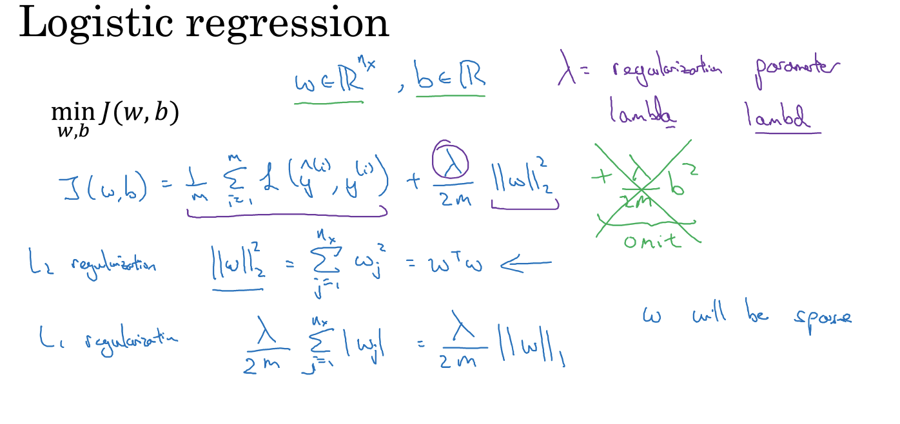
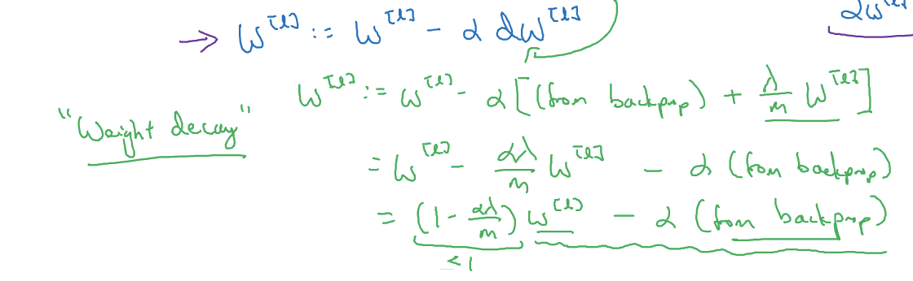

[TOC]

# 第二门课 改善深层神经网络：超参数调试、正则化以及优化

### week01：深度学习的实践层面

#### 训练、验证、测试集

+ 需要做的抉择

  + 神经网络分多少层
  + 每层含有多少个隐藏单元
  + 学习速率是多少
  + 各层采用哪些激活函数

+ 数据分配

  将样本分成训练集，验证集和测试集三部分

+ 获取数据的方法

  网页抓取

+ 搭建训练验证集合测试集能够加速神经网络的集成，也可以更有效地衡量算法地偏差和方差，从而帮助我们更高效地选择合适方法来优化算法

#### 偏差， 方差

高偏差(欠拟合)、高方差(过度拟合)****

应用训练误差和验证误差判断高偏差和高方差

#### 机器学习基础

+ 偏差高

  选择一个新的网络，或者尝试更先进的优化算法，或者花更多的时间来训练网络

  在训练学习算法时， 不断尝试这些方法，直到解决掉偏差问题，这是最低标准，反复尝试，直到可以拟合数据位置，至少能够拟合训练集。

+ 方差高

  选取更多的数据，通过正则化来减少过拟合

+ 注意

  + 高偏差和高方差是两种不同的情况，我们后续要尝试的方法也可能完全不同，通常用训练验证集来诊断算法是否存在偏差或方差为题，然后根据结果选择尝试部分方法。
  + 采用更多数据通常可以在不过多影响偏差的同时减少方差。

#### 正则化

解决高方差问题：正则化、准备更多的数据

+ 逻辑回归的正则化

  

  在网络中如何实现$L_2$ 正则化呢？

  $L_2$ 范数正则化被称为"权重衰减"

  

#### 为什么正则化有利于预防过拟合呢？

添加正则项， 可以避免数据权值矩阵过大，这就是弗罗贝尼乌斯范数

如果正则化$\lambda$ 设置得足够大，权重矩阵$W$ 被设置为接近于0的值，直观理解就是把多隐藏单元的权重设为0，于是基本上消除了这些隐藏单元的许多影响。如果是这种情况，这个被大大简化了的神经网络会变成一个很小的网络，小到如同一个逻辑回归单元，可是深度却很大，它会使这个网络从过拟合的状态更接近左图的高偏差状态。

但是$\lambda$ 会存在一个中间值，于是会有一个接近"Just Right " 的中间状态。

#### dropout正则化

随机失活

+ 精简节点

+ **inverted dropout** 

  $d^{[3]} $ 表示一个三层的$dropout$ 向量

  $d3 = np.random.rand(a3.shape[0],a3.shape[1])$ 

  $keep-prob$ 意味着消除任意一个隐藏单元的概率是，它的作用就是生成随机矩阵

#### 理解dropout

dropout可以随机删除网络中的神经单元。

+ dropout不依赖任何一个特征，因为该单元的输入可能随时被清除，因此该单元通过这种方式传播下去，并为单元的四个输入增加一点权重，通过传播所有权重，dropout将产生收缩权重的平方范数的效果。
+ dropout的功能类似于$L_2$ 正则化，与$L_2$ 正则化不同的是，被应用的方式不同，dropout也会有所不同，甚至更适用于不同的输入范围

#### 其他正则化方法

+ 数据扩增

  人工合成，换个角度，旋转etc.

+ early stopping

  运行梯度下降时，可以绘制训练误差，或只绘制代价函数$J$ 的优化过程，在训练集上用0-1记录分类误差次数。呈单调下降趋势。

  通early stopping 我们不但可以绘制上面这些内容，还可以绘制验证机误差，它可以是验证集上的分类误差，或验证集上的代价函数，逻辑损失和对数损失等，你会发现，验证集误差通常会呈下降趋势，然后在某个节点处开始上升

  Early stopping的作用是，神经网络已经在这个迭代过程中表现得很好了，在此停止训练，得到验证集误差。

  + 提前停止训练神经网络，训练神经网络时用early stopping缺点：

    不嫩独立的处理问题，提早的停止梯度下降，也就是停止了优化代价函数$J$ ,因为现在不再尝试降低代价函数$J$ ,所以代价函数$J$ 的值可能不够小，又希望不出现过拟合，没有采取不同的方式解决两个问题。

    early stopping的优点：

    只运行一次梯度下降，就可以找到$w$ 的较小值，中间值和较大值，而无需尝试$L_2$ 正则化超级参数$\lambda$ 的很多值

#### 归一化输入

加速训练的方法

+ 归一化步骤
  + 零均值
  + 归一化方差
+ 确保所有特征都在相似范围内，通常可以帮助学习算法运行得更快

#### 梯度消失/梯度爆炸

训练神经网络的时候，导数或坡度有时会变得非常大，或者非常小，甚至于以指数方式变小，这就加大了训练的难度

#### 神经网络的权重初始化

$Relu$ 激活函数，而不是$\frac{1}{n}$ ，方差设置为 $\frac{2}{n}$ ，效果会更好。

#### 梯度的数值逼近

+ 梯度检验

  确保backprop正确实施

  双边误差公式

#### 梯度检验

把所有的参数换成一个巨大的向量数据，通过双边误差来计算

#### 梯度检验应用的注意事项

+ 不要在训练的时候使用梯度检验，只用于调试

+ 如果算法的梯度检验失败，要检查所有项

+ 在实施梯度检验时， 如果使用正则化，请注意正则项

+ 梯度检验不能与dropout同时使用，因为在每次迭代过程中，dropout会随机消除隐藏层单元的不同子集，难以计算dropout在梯度下降上的代价函数$J$ 

  