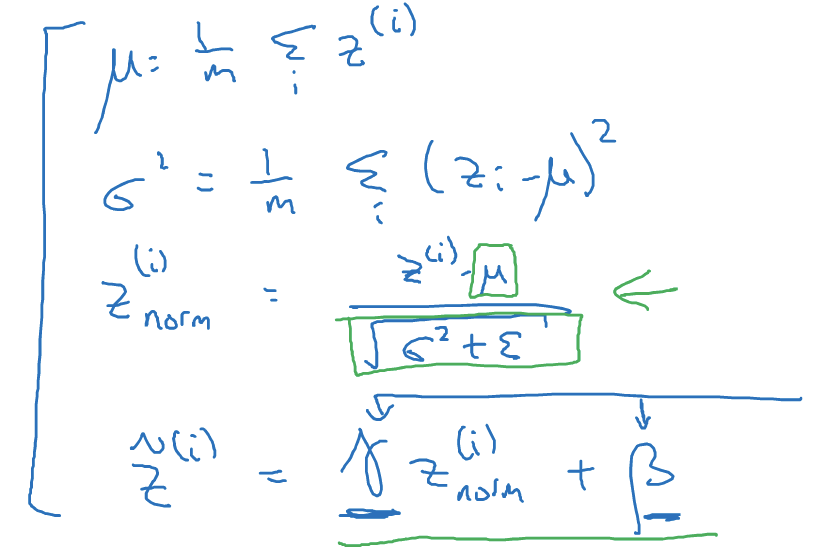

[TOC]

## 第四周学习笔记

### week03 超参数调试、Batch正则化和程序框架(Hyperparameter tuning)

#### 3.1 调试处理

神经网络的改变涉及到了很多的超参数设置。

训练深度最难的事情之一就是要处理的参数的数量，从学习速率$\alpha$ 到 **Momentum** (动量梯度下降法)的参数$\beta$ 。

如果使用 **Momentum** 或 **Adam** 优化算法的参数，$\beta_1,\beta_2$ 和 $$\varepsilon$$ ,也许你还得选择层数，等等。

最广泛的学习应用是 $\alpha$ ，学习速率是需要调试的最重要的超参数。

**如果尝试调节一些超参数，该如何选择调试值？** 

+  

  对于两个超参数，常用的做法是在网络中取样点，然后逐一尝试所有的点，看哪个参数效果最好。(适用于参数少的时候)

+ 常用的方法：**随机选择点** 用随机选取的点试验超参数的效果。

  假如有三个超参数，则搜索的范围就变成了一个立方体

+ 由粗到细

  

  现在大区域中找到合适的点，再缩小范围。

#### 3.2 为超参数选择合适的范围(Using an appropiate scale to pick hyperparameters)

随机取值并不是在有效范围内的随机均匀取值，而是选择合适的标尺，用于探究这些超参数。

```r = -4*np.random.rand()```  可以得出$r \in [-4, 0]$然后$\alpha$ 随机取值，$\alpha = 10^r$ ,那么$\alpha \in [10^{-4}, 10^0]$ 

**$\Large {\color{red}{总结}}$** 在对数坐标下取值，取最小值的对数就得到 $\alpha$ 的值，取最大值的对数就得到$b$ 值。

给$\color{maroon}{\beta}$ 取值,用于计算指数的加权平均值。如果想在$\mathrm{0.9}$ 到 $0.999$ 区间搜索，就不能用线性轴取值。因此我们选择探究 $1-\beta$ ，此值在$0.1$到$0.001$ 之间。 即 $10^{-1}$ , $10^{-3}$ 。

当$\beta$ 接近于 $1$ 时， 所得结果的灵敏度会变化，即使 $\beta$ 有微小的变化。因此在$\beta$ 即将接近于 1 的时候  要更加紧密的取值，才能更加有效地分布取样点，更有效率的探究可能的结果。

#### 3.3 超参数调试实践：Pandas VS Caviar(Hyperparameters tuning in practice: Pandas VS. Caviar)

搜索超参数的问题两种重要的思想


+ 第一种是照看一个模型，拥有庞大的数据组，但没有许多计算资源或足够的 $CPU$ 和 $GPU$ 的前提下。一次负担起试验一个模型或一个小批模型，在这样的情况下，即使当它在试验时， 也可以逐渐改良。
+ 第二种方法就是同时试验多种模型，设置一些超参数，尽管让它自己运行。

#### 3.4 归一化网络的激活函数

+ **Batch归一化**

  **Batch** 归一化会使你的参数搜索问题变得很容易，使神经网络对超参数的选择更加稳定，超参数的范围会更加庞大，工作效果也很好，也会使你的训练更加容易，甚至是深层网络。

  归一化输入特征可以加快学习过程。这是如何把学习问题的轮廓，从很长的东西，变成更圆的东西，更易于算法优化。

  在实践中，经常做的归一化 是 $z^{[2]}$ 

  

  把这些 z值标准化，化为含平均值0 和标准单位方差，所以z的每一个分量都含有平均值0和方差1，但是我们不想让隐藏单元总是含有平均值0和方差1，也许隐藏单元有了不同的分布会有意义，所以我们要计算$\check{z}^{(i)}$ 

  $\check{z}^{(i)} = \gamma z_{norm}^{(i)} + \beta$  其中 $\gamma \ , \beta$ 都是要学习的参数，所以我们使用梯度下降或一些其他类似梯度下降的算法，比如 **Momentum**或者 **Nesterov, Adam**来更新$\gamma \ \beta$ 

  **$\large{\color{red}{\gamma \ 和 \beta 的作用：}}$ ** 可以随意设置 $\check{z}^{(i)}$ 的平均值 ，事实上 ，如果 $\gamma = \sqrt{\sigma^2 + \varepsilon}$ 

  $\beta = \mu$ 那么$ \gamma z_{norm}^{(i)} + \beta$ 的作用就在于，它会精确转化这个方程 $\check{z}^{(i)} = z^{(i)}$ 

   通过赋予$\gamma \ \beta$ 其他的值，可以构造含有其他平均值和方差的隐藏单元值。

  均值和方差可以使 0 和 1， 也可以是其他值，由$\gamma$ 和 $\beta$ 来决定。

#### 3.5 将Batch Norm 拟合进神经网络(Fitthing Batch Norm into a neural network)


每个单元负责两件事：计算z，然后应用到激活函数中再计算 a。

Batch归一化的做法是将 $z^{[1]}$ 值进行Batch归一化，简称 **BN** ,此过程将由 $\beta^{[1]}$ 和 $\gamma^{[1]}$ 两参数控制，这一操作会给你一个新的规范化的 $z^{[1]}$ 值($\check{z}^{[1]}$) ，然后将其输入到激活函数中得到 $a^{[1]}$ 即 $a^{[1]} = g^{[1]}(\check{z}^{[l]})$ 

在实践中，**Batch**归一化通常和训练集的 **mini-batch**一起使用。


在计算过程中 $z^{[l]}  = w^{[l]}a^{[l-1]} + b^{[l]}$ 。但 **Batch** 归一化做的是，它要看这个 **mini-batch**，先将 $z^{[l]}$ 归一化，结果为均值0和标准房差，再由$\beta $ 和 $\gamma$ 重缩放。但这意味着，无论 $b^{[l]}$ 的值是多少，都是要被减去的，因为在 **Batch**归一化的过程中，你要计算 $z^{[l]}$ 的均值，再减去平均值，在此例中的 **mini-batch**中添加任何常数，数值都不会改变。所以在使用 **Batch**归一化，可以消除这个参数 $b^{[l]}$ ，或者设置为0，


各个参数的维数。更新各个参数：

$w^{[l]} = w^{[l]} - \alpha dw^{[l]} \\ \beta^{[l]} = \beta^{[l]} - \alpha d\beta^{[l]} \\ \gamma^{[l]} = \gamma^{[l]} - \alpha d\gamma^{[l]}$

这也适用于 **Monentum、RMSprop、Adam** 的梯度下降法。

也可以使用其他的一些优化算法来更新由 **Batch**归一化添加到算法中的 $\beta$ 和 $\gamma$ 参数。

#### 3.6 Batch Norm 为什么奏效？(Why does Batch Norm work?)

通过归一化所有的输入特征值 $x$ ， 以获得类似范围的值，可以加速学习。

它可以使权重比你的网络更滞后或更深层。

**Covariate shift** 如果你已经学习了 x 到 y  的映射，如果 x 的分布改变了，那么你可能需要重新训练你的学习算法。

**Covariate shift** 的问题怎么应用于神经网络呢？


例如此神经网络，从第三隐藏层开始学起，他得到一些值，如图，但这些值也可能是特征值 $x_1, x_2, x_3,x_4$，第三隐藏层的工作是找到一种方式，使这些值映射到 $\hat{y}$ 。

隐藏层的值在不断改变， **Batch**归一化做的，是它减少了这些隐藏值分布变化的数量。**Batch**归一化讲的是 $z_1^{[2]} ，z_2^{[2]}$ 的值可以改变，他们的确会改变，当神经网络在之前层中更新参数，**Batch**归一化可以确保无论其怎么变化 $z_1^{[1]} ， z_2^{[2]}$ 的均值和方差保持不变，所以即使 $z_1^{[1]} ， z_2^{[2]}$ 的值改变，至少他们的均值和方差也会是均值0， 方差1，或不一定必须是均值0，方差1，而是由 $\beta^{[2]} , \gamma^{[2]}$ 决定的值。

**Batch**归一化减少了输入值改变的问题，它的确使这些值变得更稳定，神经网络的之后层就会有更坚实的基础。即使时输入分布改变小一些，它的改变会更小。它做的是当前层保持学习，当改变时，迫使后层适应的程度减小了，它减弱了前层参数的作用与后层参数的作用之间的联系。它使得网络每层都可以自己学习，稍稍独立于其它层，这有助于加速整个网络的学习。

**Batch**归一化还有一个作用，它有轻微的正则化效果，**Batch**归一化中非直观的一件事是，每个 **mini-batch**上计算的均值和方差，而不是在整个数据集上，均值和方差有一些小的噪声，因为它只在你的 **mini-batch**上计算，比如64或128或256或更大的训练例子。

在此过程中会有一些噪音。所以和 **dropout** 相似，它往每个隐藏层的激活层上增加了噪音， **dropout**有增加噪音的方式，它使一个隐藏的单元，以一定的概率乘以0，以一定的概率乘以1，所以你的dropout含几重噪音，因为它乘以0或1。

应用较大的 **mini-batch**可以减少正则化效果。

不要把 **Batch**归一化当做正则化，把它当做将你归一化隐藏单元激活值并加速学习的方法。

#### 测试时的 Batch Norm(Batch Norm at test time)

**Batch** 归一化将你的数据以 **mini-batch**的形式逐一处理，但在测试时，你可能需要对每个样本逐一处理。


​	用于调节计算的 $\mu$ 和 $\sigma^2$ 是在整个 **mini-batch**上进行计算，但是在测试时，可能不能将一个 **mini-batch**中的6428或2056个样本同时处理，因此你需要用其他方式来得到 $\mu$ 和 $\sigma^2$ ，而且如果你只有一个样本，一个样本的均值和方差没有意义。实际上，为了将你的神经网络运用与测试，就需要单独估算 $\mu$ 和 $\sigma^2$ ，在典型的 **Batch**归一化运用中，你需要用一个指数加权平均来估算，这个平均数涵盖了所有 **mini-batch**


在训练时， $\mu$ 和 $\sigma^2$ 是在整个 **mini-batch**上计算出来的包含了像是64或28或其他一定数量的样本，但在测试时，你可能需要逐一处理样本，方法是根据你的训练集估算 $\mu$ 和 $\sigma^2$ ，估算的方式有很多种， 理论上你可以在最终的网络中运行整个训练集来得到 $\mu$ 和 $\sigma^2$ ，但在实际操作中，我们通常运用指数加权平均来追踪在训练过程中你看到的 $\mu$ 和 $\sigma^2$ 的值。然后在测试中使用 $\mu$ 和 $\sigma^2$ 的值来进行你所需要的隐藏单元z值得调整。

​	使用 **Batch**归一化，你能够训练更深的网络，让你的学习算法运行速度更快。

#### 3.8 Softmax 回归 (Softmax regression)

多分类方式：逻辑回归。


输出层有4个，输出层单元的数字告诉我们这4中类型中每个概率有多大，所以这里的第一个节点输出的应该是或者说我们希望它输出"其他"类的概率。

这里的$\hat{y}$ 是一个$4 \times 1$ 的向量，因为它必须输出四个数字。给定四个概率，且概率相加等于1。

让网络做到这一点的标准模型要用到 **Softmax层** ，以及输出层来生成输出。

和往常一样计算  $z^{[l]} = W^{[l]}a^{[L-1]} + b^{[l]}$ ，算出了 z之后，需要应用 **Softmax**激活函数，这个激活函数对于 **Softmax** 层而言有些不同。

**它的作用是这样的：**

首先计算一个临时变量  $\large t = e^{z^{[l]}}$  , 这是对所有元素求幂， t也是一个 $4 \times 1$ 维向量，然后输出的 $a^{[l]}$ ,基本上就是向量 t ，但是会归一化，使其和为1。因此 $\large{a^{[l]} = \frac{e^{z^{[l]}}}{\sum_{i=1}^4t_i}}$ 

#### 3.9 训练一个Softmax分类器

Softmax回归或Softmax激活函数将logistic激活函数推广到 C 类，而不仅仅是两类。结果如果是 C = 2，那么 C = 2 的 **Softmax**实际上变回了 **logistic**回归

**Sotfmax**回归将 **logistic** 回归推广到了两种分类以上。

+ **用什么样的损失函数来训练这个神经网络？** 

  在 **Softmax**中我们一般用到的损失函数是$L(\hat{y}, y) = -\sum_{j=1}^4y_ilog\hat{y}_j$ 

损失函数所做的就是找到训练集中的真实类别，然后试图使该类别相应的概率尽可能地高。

整个训练样本的损失值：$J(w^{[1]}, b^{[1]},……) = \frac{1}{m}\sum_{i = 1}^mL(\hat{y}^{(i)},y^{(i)})$

这里要用梯度下降法，使损失最小化。

#### 3.11 TensorFlow

损失函数： $Jw = w^2 - 10w + 25$ 

**$\large{\color{maroon}{TensorFlow实现损失函数最小化}}$**

**placeholder**函数会告诉 **TensorFlow** 它稍后会为 x 提供数值。

```cost = x[0][0]*w**2 + x[1][0]*w + x[2][0]```

**TensorFlow**程序的核心是计算损失函数，然后 **TensorFlow**自动计算出导数，以及如何最小化损失，因此这行代码或者这个等式所做的就是让 **TensorFlow**建立计算图，计算图所做的就是取 $x[0][0]$ ，取 w ，然后将它平方，然后 $x[0][0]$ 和 $w^2$ 相乘，以此类推，最后得到损失函数。

**TensorFlow**的优点在于，通过用这个计算损失，计算图基本实现前向传播，**TensorFlow**已经内置了所有必要的反向函数