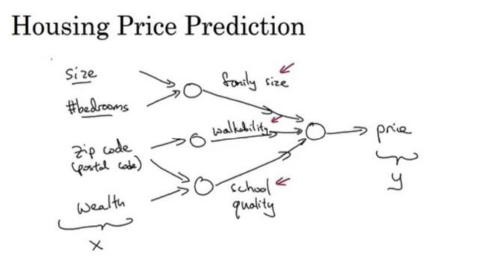
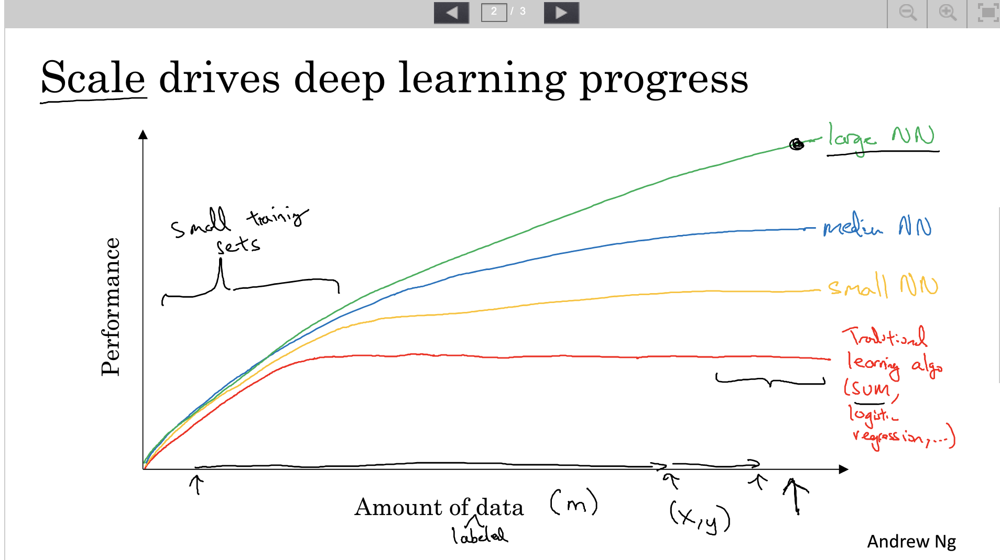
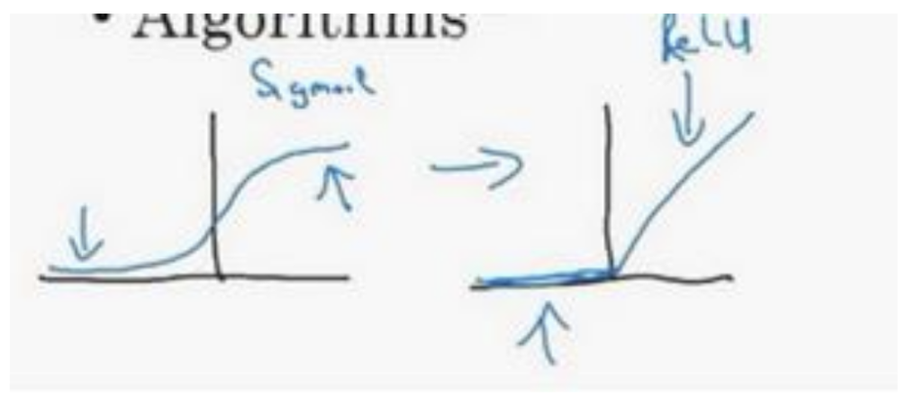
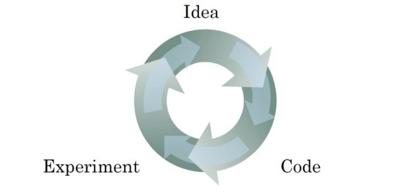

[TOC]

## 第一周 深度学习概论

### 什么是神经网络

+ 例如，房屋价格预测

  把房屋的面积作为神经网络的输入(称之为X) ，通过一个节点，最终输出了价格(称之为y)。

  如果还有一些其他的特征可以作为房屋预测价格神经网络的输入

  

  其中有 房屋大小、卧室数量、邮政编码、富裕程度 作为输入(X)

  在上图中每一个画的小圆圈都可以使ReLU的一部分，也就是指修正线性单元，或者它稍微非线性的函数。

  其中基于房屋面积和卧室数量，可以估算家庭人口；基于邮编，可以估测不行化程度或者学校质量。

  y是用神经网络尝试预测的价格，把这些单个的神经元叠加在一起，就有了一个稍微大的神经网络。

  定义好神经网络之后，我们需要做的就是输入x，进而就能得到输出的y。

  所以在实际工作中我们需要做的就是：给出这些输入的特征之后，神经网络的工作就是预测对应的价格。同时也注意到这些被叫做隐藏神经元圆圈，在一个神经网络中，它们每个都从输入的四个特征获得自身输入，比如说，第一个结点代表家庭人口，而家庭人口仅仅取决于$x_1 和 x_2$ 特征，换句话说，在神经网络中，你决定在这个结点中想要的到什么，然后用所有的四个输入来计算想要得到的。因此，我们说输入层和中间层被紧密的连接起来了。

  神经网络非常擅长计算从x到y的精准映射函数。

+ ReLU激活函数

  **Rectified Linear Unit** 从趋于零开始，然后变成一条直线。

  可以理解为$max(0,x)$ 

### 用神经网络进行监督学习

+ 神经网络的应用

  在线广告、计算机视觉、语音识别、自动驾驶。

  对于图像应用我们在神将网络上使用CNN(Convolutional Neural Network)，而对于序列数据，例如音频，经常使用RNN(Recurrent Neural Network)，etc。 

  **结构化数据和非结构化数据**

  + 结构化数据

    数据的基本数据库 例如房屋预测 有专门的几列数据

  + 非结构化数据

    音频，图片

  + 正是由于深度学习和神经网络，计算机才能更好的解释非结构化数据。

+ 在监督学习中输入

   神经网络很大程度上改变了深度学习

### 为什么深度学习会兴起？

推动深度学习变得如此热门的主要因素。包括数据规模、计算量和算法的创新。

+ 

  - 对于传统的学习算法

    最终的性能取决于手工设计组件的技能，以及算法处理的细节

  - 神经网络领先于传统学习算法

  - 如果想要获得较高性能的体现需要做以下两点：

    - 训练一个规模足够大的神经网络
    - 需要大量的数据

+ 神将网络方面 的一个重大突破就是$sigmoid函数转换到一个ReLU函数$

  + 
  + **sigmoid**函数的梯度会接近零，所以学习的速度会变得非常缓慢，因为当梯度下降以及梯度接近零的时候，参数会更新的很慢，所以学习的速率也会变得很慢
  + **ReLU** 函数，它的梯度对于所有输入的复值都是零，因此梯度更加不会逐渐减少到零。
  + 算法的创新是对计算带来的优化，通过改变算法，使得代码运行的更快。

+ 训练一个神将网络的步骤就是迭代

  

  

  

  

  

  

  

  

  

  

  

  

  

  

  

  

  

  

  

  

  

  

  

  

  

  

  

  

  

  

  

  

  

  

  

  