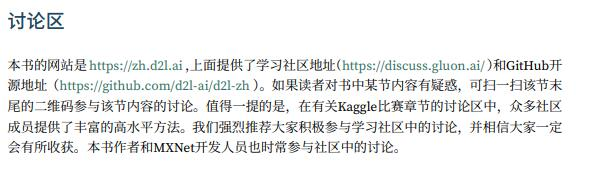
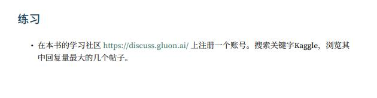

[TOC]

# 动手学深度学习

## 绪论

### 应用深度学习需要同时理解

+ 问题的动机和特点
+ 将大量不同类型神经网络层通过特定方式组合在一起的模型背后的数学原理
+ 在原始数据上拟合极复杂的深层模型的优化算法
+ 有效训练模型、避免数值计算陷阱以及充分利用硬件性能所需的工程技能
+ 为解决方案挑选合适的变量（超参数）组合的经验

### 学习环境

+ github  Jupyter  Sphinx  Discourse 

### 本书框架

## 深度学习简介

